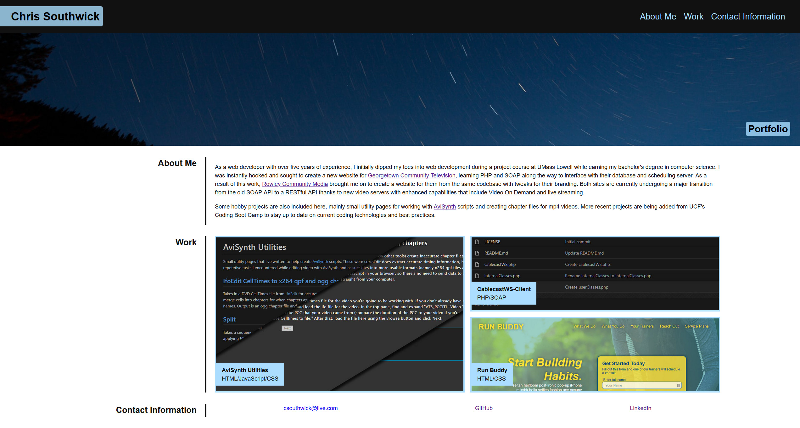

# Professional Portfolio

A showcase of past and present code projects maintained by Chris Southwick.

## Contains
* Introduction/about me
* A screenshot of each project that links to either the live site, where possible, or else to the code repository for server-side projects which GitHub cannot host as a live site.
* Contact information

## Built With
* HTML
* CSS

## Website
https://csouthwick.github.io/portfolio/

## Screenshot

